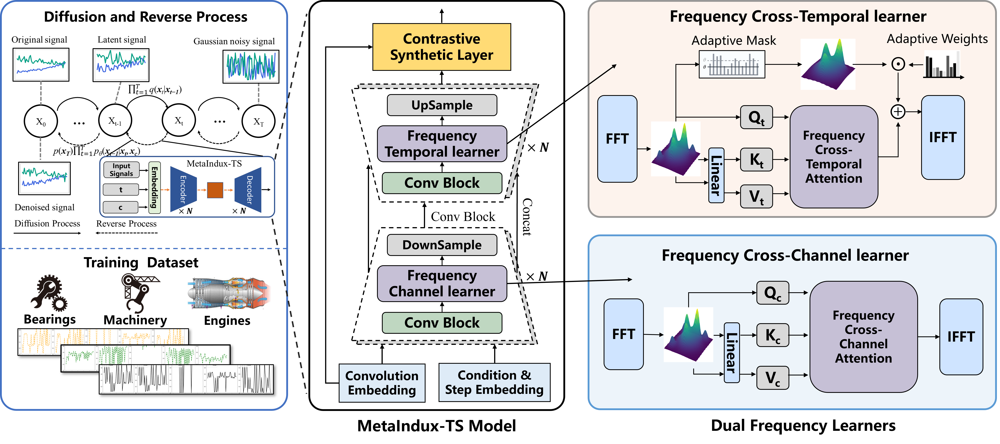

# MetaIndux-TS

Source codes for the paper "MetaIndux-TS: Frequency-Aware AIGC Foundation Model for Industrial Time Series"[IEEE Transactions on Neural Networks and Learning Systems] by Haiteng Wang, Lei Ren, Yikang Li.

MetaIndux-TS is a frequency-informed AIGC foundation model based on diffusion model frameworks. This model is designed to generate industrial time-series data under a variety of working conditions, across different types of equipment, and with variable lengths. Specifically, MetaIndux-TS integrates dual-frequency cross-attention networks, transforming time series into the frequency domain to model multivariate dependencies and capture intricate temporal details. In addition, MetaIndux-TS exhibits zero-shot generation capabilities for samples under unseen conditions, offering the potential to address data collection challenges in extreme environments.



## 1. Setup

* **Python**: 3.8+ recommended.
* **Dependencies**: Install necessary packages.
    ```bash
    pip install -r requirements.txt
    ```
    Ensure PyTorch is installed matching your CUDA version if GPU is used.
* **Data**:
    * For CMAPSS datasets (e.g., `FD001`): Place `train_FD001.txt`, `test_FD001.txt`, and `RUL_FD001.txt` in the `./data/` directory.
    * For N-CMAPSS datasets (e.g., `s01`): Ensure your data is processed according to `data_process.py` and accessible (e.g., in a `./dataset/` folder as referenced by `data_process.py`).

## 2. Operating `MainCondition.py`

`MainCondition.py` is the central script for all core tasks. Its behavior is primarily controlled by command-line arguments.

### Key Command-Line Arguments:

* `--dataset <name>`: Specifies the dataset (e.g., `FD001`, `sFD001`).
* `--model_name <name>`: Selects the U-Net model architecture (e.g., `DiffUnet_fre`, `DiffUnet_c`).
* `--state <mode>`: Determines the operation:
    * `train`: Train a new model.
    * `sample`: Generate synthetic data using a trained model.
    * `eval`: Evaluate generated synthetic data.
    * `all`: Perform train, sample, and then eval sequentially.
* `--window_size <int>`: Length of the time-series window (e.g., `48`).
* `--input_size <int>`: Number of input features/sensors (e.g., `14` for FD001).
* `--T <int>`: Number of diffusion timesteps (e.g., `1000`).
* `--epoch <int>`: Number of training epochs (used with `state='train'`).
* `--lr <float>`: Learning rate (used with `state='train'`, e.g., `2e-4`).
* `--batch_size <int>` or `-b <int>`: Batch size for training/sampling (e.g., `64`).
* `--model_path <path>`: Path to save (during training) or load (during sampling/eval) model weights.
    * Default format: `weights/<model_name>_<dataset>_<window_size>.pth`
* `--syndata_path <path>`: Path to save (during sampling) or load (during eval) synthetic data.
    * Default format: `./weights/syn_data/syn_<dataset>_<model_name>_<window_size><sample_type>.npz`
* `--sample_type <type>`: Sampling algorithm (`ddpm` or `ddim`, default `ddim`).

### 2.1. Training (`state='train'`)

This mode trains the diffusion model on the specified dataset.

* **Purpose**: To learn the data distribution and how to generate RUL-conditioned time series.
* **Example Command**:
    ```bash
    python MainCondition.py \
        --dataset FD001 \
        --model_name DiffUnet_fre \
        --state train \
        --window_size 48 \
        --input_size 14 \
        --T 1000 \
        --epoch 100 \
        --lr 2e-4 \
        --batch_size 64
    ```
* **Output**:
    * Trained model weights saved to the path specified by `--model_path` (or the default path).
    * After training, it automatically proceeds to sample data using the trained model and training labels as conditions.

### 2.2. Generating / Sampling Data (`state='sample'`)

This mode uses a pre-trained model to generate synthetic time-series data.

* **Purpose**: To create new data samples conditioned on RUL values (typically from the training set labels).
* **Prerequisite**: A trained model (weights file).
* **Example Command**:
    ```bash
    python MainCondition.py \
        --dataset FD001 \
        --model_name DiffUnet_fre \
        --state sample \
        --window_size 48 \
        --input_size 14 \
        --T 1000 \
        --model_path weights/DiffUnet_fre_FD001_48.pth # Specify path to your trained model
    ```
* **Output**:
    * Synthetic data saved as an `.npz` file to the path specified by `--syndata_path` (or the default path).
    * After sampling, it automatically proceeds to evaluate the generated samples.

### 2.3. Evaluating Data (`state='eval'`)

This mode evaluates the quality of previously generated synthetic data against real test data.

* **Purpose**: To assess the fidelity and utility of the generated samples using various metrics.
* **Prerequisites**:
    * Generated synthetic data (an `.npz` file).
    * Real test data for the specified dataset.
* **Example Command**:
    ```bash
    python MainCondition.py \
        --dataset FD001 \
        --model_name DiffUnet_fre \
        --state eval \
        --window_size 48 \
        --input_size 14 \
        --syndata_path ./weights/syn_data/syn_FD001_DiffUnet_fre_48ddim.npz # Specify path to your synthetic data
    ```
* **Output**:
    * Prints evaluation scores to the console.
    * Logs metrics to Weights & Biases (if configured, offline by default). Metrics include:
        * Predictive scores (RMSE, MAE from a downstream RUL predictor).
        * Discriminative score.
        * Context-FID.
        * Cross-Correlation Loss.

### 2.4. All-in-One (`state='all'`)

This mode sequentially performs training, then sampling, and finally evaluation.

* **Purpose**: For a complete end-to-end run from training to evaluation.
* **Example Command**:
    ```bash
    python MainCondition.py \
        --dataset FD001 \
        --model_name DiffUnet_fre \
        --state all \
        --window_size 48 \
        --input_size 14 \
        --T 1000 \
        --epoch 100 \
        --lr 2e-4 \
        --batch_size 64
    ```
* **Output**: Combines outputs from training, sampling, and evaluation stages.

## 3. Default Run Behavior

If `MainCondition.py` is run without any command-line arguments:
```bash
python MainCondition.py
```

## Citation
If you find this code helpful, please cite our paper:

```
@article{wang2025meta,
  title={MetaIndux-TS: Frequency-Aware AIGC Foundation Model for Industrial Time Series},
  author={Wang, Haiteng and Ren, Lei  and Li, Yikang},
  journal={IEEE Transactions on Neural Networks and Learning Systems},
  year={2025},
  publisher={IEEE}
}
```

```
@article{ren2024diff,
  title={Diff-MTS: Temporal-Augmented Conditional Diffusion-Based AIGC for Industrial Time Series Toward the Large Model Era},
  author={Ren, Lei and Wang, Haiteng and Laili, Yuanjun},
  journal={IEEE Transactions on Cybernetics},
  year={2024},
  publisher={IEEE}
}
```
